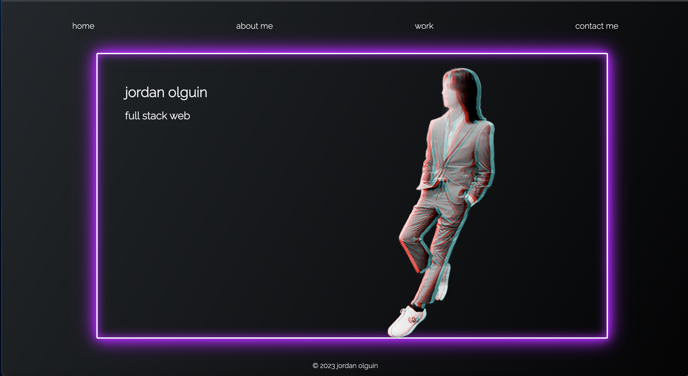

# Professional Web Development Portfolio

As a recent graduate of a Full Stack Web Development Bootcamp, I've created this portfolio to showcase my skills and projects to potential employers and fellow developers. This portfolio leverages the latest web technologies to provide an interactive and engaging experience.

## Live Portfolio

👉 Explore my portfolio: [Professional Web Development Portfolio](https://jordanolguin.github.io/REACTWebDevPortfolio/)

## Key Features

- **Modern React UI/UX**: I've crafted an intuitive and visually appealing user interface using React.js, ensuring a seamless and delightful user experience.
- **Sneak Peek**: Here's a quick glance at the portfolio's sleek design:

  

## How to Contribute

I welcome contributions from the developer community. If you have ideas for enhancements or would like to report issues, please start by opening an issue to discuss your suggestions. Don't forget to maintain test coverage when proposing changes.

## License

This project is open-source and available under the permissive [MIT License](https://choosealicense.com/licenses/mit/). Feel free to use, modify, and distribute the code while complying with the terms of the license.

If you have any questions or feedback, please reach out. Thank you for visiting my portfolio – let's connect and discuss exciting opportunities! 🚀
